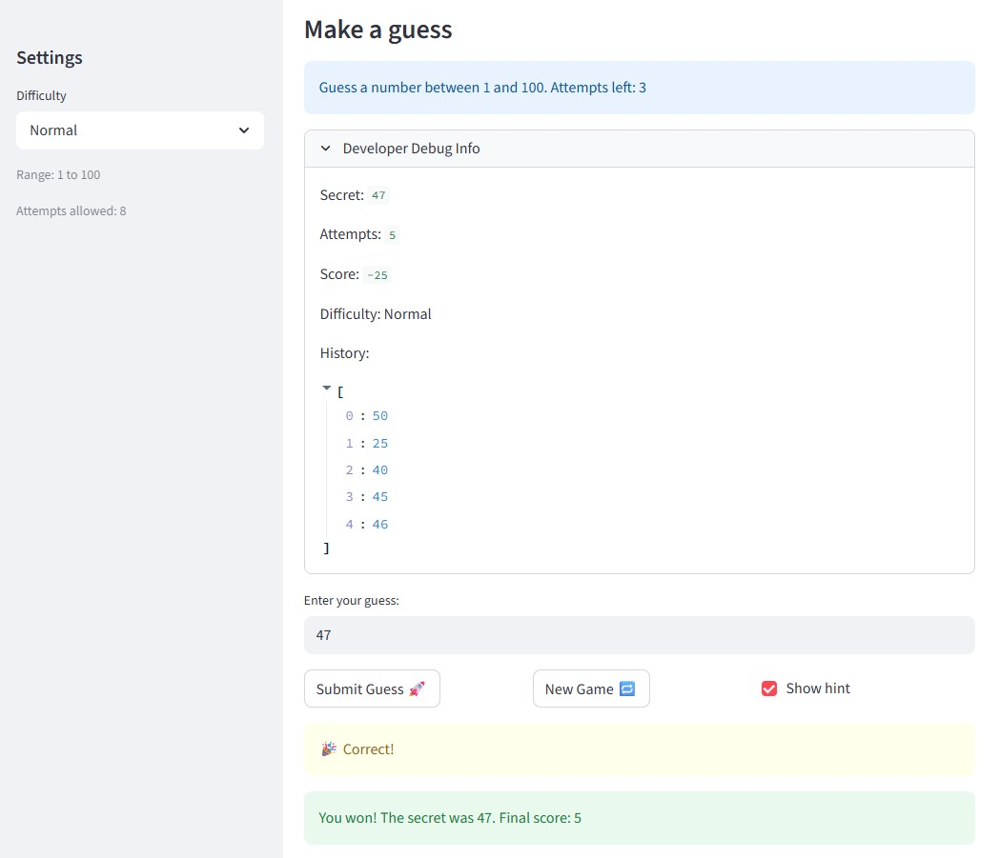
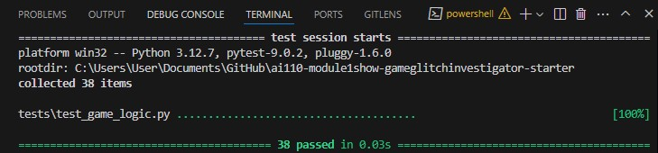
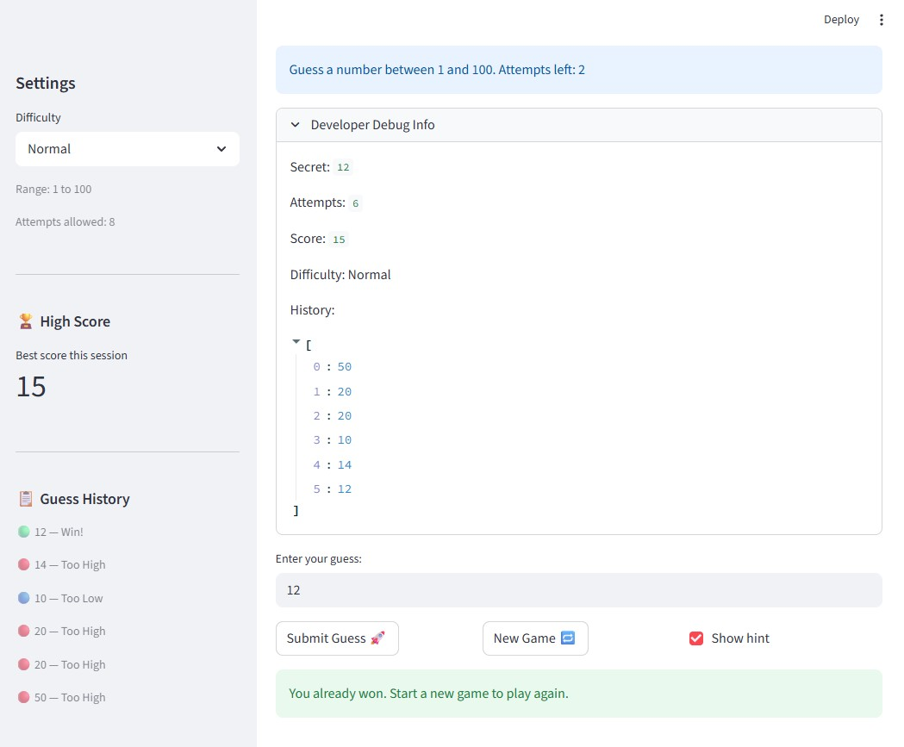

# 🎮 Game Glitch Investigator: The Impossible Guesser

## 🚨 The Situation

You asked an AI to build a simple "Number Guessing Game" using Streamlit.
It wrote the code, ran away, and now the game is unplayable. 

- You can't win.
- The hints lie to you.
- The secret number seems to have commitment issues.

## 🛠️ Setup

1. Install dependencies: `pip install -r requirements.txt`
2. Run the broken app: `python -m streamlit run app.py`

## 🕵️‍♂️ Your Mission

1. **Play the game.** Open the "Developer Debug Info" tab in the app to see the secret number. Try to win.
2. **Find the State Bug.** Why does the secret number change every time you click "Submit"? Ask ChatGPT: *"How do I keep a variable from resetting in Streamlit when I click a button?"*
3. **Fix the Logic.** The hints ("Higher/Lower") are wrong. Fix them.
4. **Refactor & Test.** - Move the logic into `logic_utils.py`.
   - Run `pytest` in your terminal.
   - Keep fixing until all tests pass!

## 📝 Document Your Experience

- [x] **Game purpose:** A number-guessing game built with Streamlit. The player picks a difficulty (Easy 1–20, Normal 1–100, Hard 1–50), then guesses the hidden secret number within a limited number of attempts. Each guess returns a "Too High" or "Too Low" hint. The player wins by guessing correctly before running out of attempts.

- [x] **Bugs found:**
  - **Bug 1** — Hint messages were swapped: guessing too high showed "Go HIGHER" and guessing too low showed "Go LOWER."
  - **Bug 2** — The attempts counter was initialized to `1` instead of `0`, giving the player one fewer guess than allowed (off-by-one error).
  - **Bug 3** — On even-numbered attempts, the secret number was cast to a string, breaking numeric comparison (e.g. `"9" > "10"` is `True` lexicographically but `False` numerically).
  - **Bug 4** — The "New Game" button always generated a new secret using the hardcoded range `1–100`, ignoring the selected difficulty.
  - **Bug 5** — The "New Game" button did not reset `score`, `status`, or `history`, leaving the app stuck in a won/lost state after the first round.

- [x] **Fixes applied:**
  - **Bug 1** — Swapped the return messages in `check_guess` in `logic_utils.py` so "Too High" → "Go LOWER" and "Too Low" → "Go HIGHER."
  - **Bug 2** — Changed `st.session_state.attempts = 1` to `= 0` in `app.py`.
  - **Bug 3** — Removed the parity check that cast the secret to a string on even attempts; `secret` is now always passed as an integer.
  - **Bug 4** — Changed `random.randint(1, 100)` in the new-game handler to `random.randint(low, high)` where `low` and `high` come from `get_range_for_difficulty(difficulty)`.
  - **Bug 5** — Added `score`, `status`, and `history` resets to the new-game handler so every round starts from a clean state.
  - **Refactor** — Moved `get_range_for_difficulty`, `parse_guess`, `check_guess`, and `update_score` out of `app.py` into `logic_utils.py` to separate game logic from UI code.

## 📸 Demo

- [x] Screenshot of the fixed game winning a round (Normal difficulty, correct guess confirmed):

## 🚀 Stretch Features

### Advanced Edge-Case Testing

38 pytest cases across 8 test classes in `tests/test_game_logic.py`, generated with targeted Claude Code prompting. Edge cases cover:

| Class | Cases | What is tested |
|---|---|---|
| `TestParseGuessEdgeCases` | 8 | Non-numeric strings, special characters, empty/None input, negative numbers, floats, whitespace, very large numbers |
| `TestCheckGuessEdgeCases` | 3 | Boundary values: exact match at 1, off-by-one above and below secret |
| `TestUpdateScoreEdgeCases` | 2 | Score floor clamp at high attempt counts, unknown outcome is a no-op |
| `TestFormatHistoryEntry` | 4 | Emoji icon per outcome (Too High, Too Low, Win, unknown) |
| `TestValidateGuessRange` | 6 | In-range, both boundaries, below range, above range, error message content |

Prompt used to generate the edge-case suite:
> *"Write pytest edge cases for `parse_guess` covering non-numeric strings, negative numbers, empty/None input, floats, and whitespace. Also add boundary tests for `check_guess`, `update_score`, `format_history_entry`, and `validate_guess_range`."*

Screenshot of all tests passing:

### Feature Expansion via Agent Mode

New features and UX improvements implemented via Claude Code Agent Mode prompts that coordinated changes across `logic_utils.py`, `app.py`, and `tests/test_game_logic.py` simultaneously:

**Agent prompts used:**
> *"Add a Guess History sidebar that shows each guess with a coloured emoji indicator (🔴 too high, 🔵 too low, 🟢 win), and a High Score tracker that persists the player's best score across games. Put the formatting logic in logic_utils.py so it can be unit tested."*

> *"Add range validation so guesses outside the difficulty range show an error without consuming an attempt. Add a validate_guess_range function to logic_utils.py and wire it into app.py between parse_guess and the game logic."*

**How Agent Mode orchestrated the multi-file changes:**

| File | Change |
|---|---|
| `logic_utils.py` | Added `format_history_entry(guess, outcome)` for sidebar display; added `validate_guess_range(guess, low, high)` for out-of-range rejection |
| `app.py` | Added `guess_log` and `high_score` session state; wired Guess History and High Score sidebar panels; sidebar moved after submit handler so history is always current; sidebar also rendered before `st.stop()` so it stays visible on game over; Enter-key submission via `on_change` flag; range validation between parse and game logic; `attempts_info` placeholder so attempt count updates correctly after each guess; difficulty change auto-resets the game |
| `tests/test_game_logic.py` | Added `TestFormatHistoryEntry` (4 cases) and `TestValidateGuessRange` (6 cases) |

The Agent consistently placed new logic in `logic_utils.py` rather than inline in `app.py` so every new function stays independently unit-testable, with coordinated test additions in the same pass.

- [x] Screenshot of the Enhanced Game UI with Guess History sidebar and High Score tracker:

