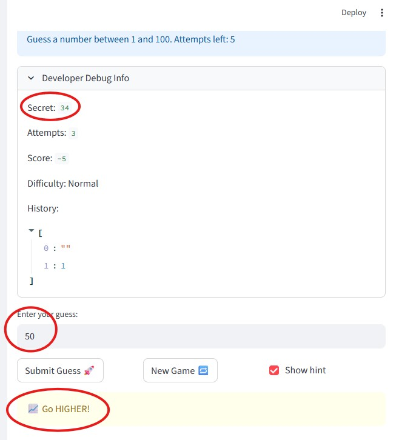
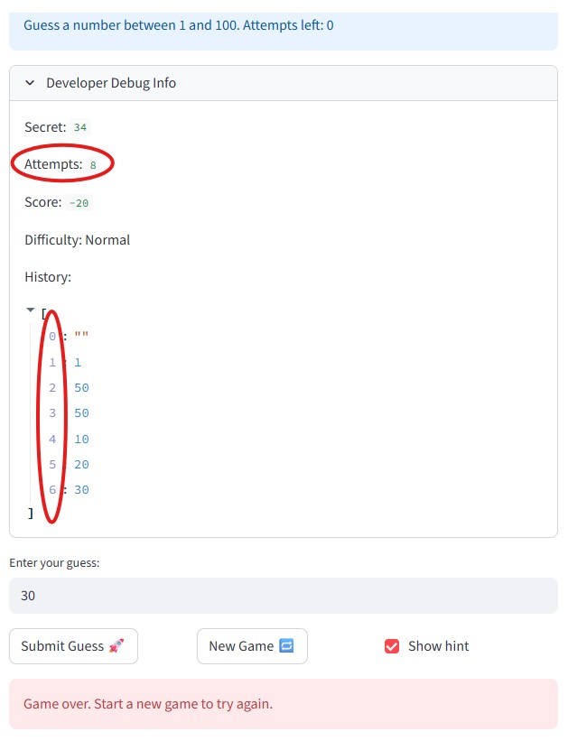
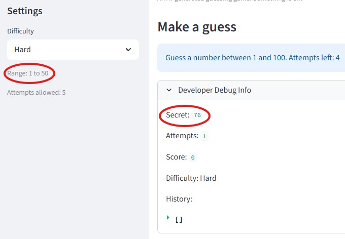
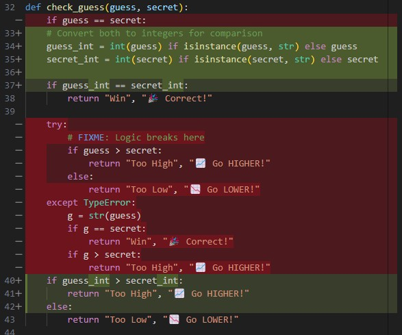
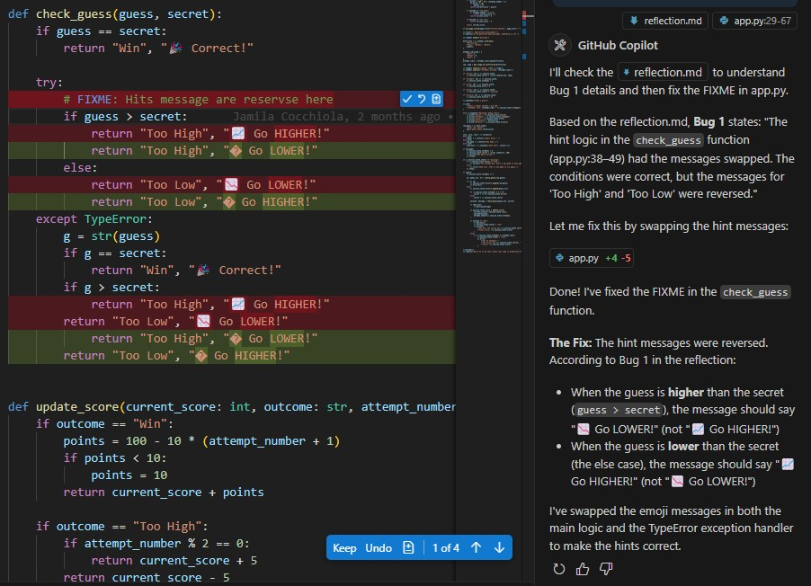
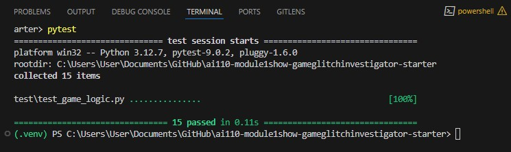

# 💭 Reflection: Game Glitch Investigator

Answer each question in 3 to 5 sentences. Be specific and honest about what actually happened while you worked. This is about your process, not trying to sound perfect.

## 1. What was broken when you started?

- What did the game look like the first time you ran it?
- List at least two concrete bugs you noticed at the start  
  (for example: "the secret number kept changing" or "the hints were backwards").

### Answer:
- When I first loaded the game, the UI appeared normal and the secret number was hidden as expected. I played a round and noticed that the hints for "higher" and "lower" were incorrect: for example, when I guessed a number lower than the secret, the game said "Too high" instead of "Too low." I confirmed this by checking checking the Developer Debug Info and the hint logic.

- Another issue happened after finishing a game. When I clicked the “New Game” button, the game didn’t actually reset. The attempts counter and guess history were still there, so the game didn’t really start fresh unless I refreshed the page manually. This happened every time I finished a round.
- I also noticed that the attempts counter was off by one. For example, if the game allowed 8 attempts, I could only actually make 7 guesses before the game ended.

- Another issue was that when selecting a difficulty level, the secret number was sometimes not within the expected range.

- With help from AI (mainly Copilot), I traced these problems to specific parts of the code:
  - **Bug 1**: The hint logic in the `check_guess` function (app.py:38–49) had the messages swapped. The conditions were correct, but the messages for “Too High” and “Too Low” were reversed.
  - **Bug2**: The attempts counter was initialized at 1 instead of 0 (app.py:96), causing the first guess to count as two attempts and resulting in an off-by-one error.
  - **Bug3**: The secret number was cast to a string on even attempts (app.py:158-161), which broke comparison logic and caused unpredictable behavior when comparing guesses to the secret.
  - **Bug 4**: The “New Game” button always reset the range to 1–100 (app.py:136), even if the player had selected a custom range or difficulty.
  - **Bug 5**: The “New Game” button didn’t fully reset the game state (app.py:134-138). It didn’t reset the score, status, or guess history. If player won/lost a game, the status stayed the same, so the game wouldn’t let player play a new round properly.

---

## 2. How did you use AI as a teammate?

- Which AI tools did you use on this project (for example: ChatGPT, Gemini, Copilot)?
  - Copilot, ChatGPT and Claude Code

- Give one example of an AI suggestion that was correct (including what the AI suggested and how you verified the result).
  - Copilot found the attempts counter was initialized at 1 instead of 0 in app.py (line 96). This caused the first guess to count as two attempts, resulting in an off-by-one error where I could only make 7 guesses instead of the expected 8. After changing the initialization to 0 and testing the game, I confirmed that the attempts counter now matched the allowed number.

- Give one example of an AI suggestion that was incorrect or misleading (including what the AI suggested and how you verified the result).
  - Copilot suggested that the comparison logic in the `check_guess` function was incorrect. Below screenshot shows Copilot fix it in the wrong way.
  
  
  - After reviewing the code, I found that the logic was correct, but the hint messages for "Too High" and "Too Low" were reversed. Swapping the messages fixed the issue, which I verified by testing the game in the browser. The screenshot below shows the fixed code after I updated my prompt to ask Copilot to fix only the messages, not the logic.
  
---

## 3. Debugging and testing your fixes

- How did you decide whether a bug was really fixed?
  - A bug was considered fixed only when a targeted pytest case passed, the behavior made sense when I manually traced through the logic, and I confirmed the fix by testing it in the browser. For example, fixing Bug 3 (string casting) wasn't enough to just remove the offending lines — I also wrote a test that confirmed `check_guess(9, 10)` returns `"Too Low"` (numeric comparison), and a second test showing that passing a string secret `"10"` now raises a `TypeError`, which proves the fix removed the problematic path entirely.

- Describe at least one test you ran (manual or using pytest) and what it showed you about your code.
  - I wrote 15 pytest cases in `test/test_game_logic.py`, organized into four classes, one per bug. The most revealing was `TestBug3SecretStringCasting`: it exposed that string comparison of `"9" > "10"` is `True`, which means the original even-attempt string cast would silently return the wrong direction hint without any error. Without this test I might not have understood *why* the bug caused intermittent wrong hints rather than a consistent failure. Running `python -m pytest test/test_game_logic.py -v` with the `.venv` activated gave 15/15 passed, confirming all four bugs were resolved.
  

- Did AI help you design or understand any tests? How?
  - Yes. Claude Code proposed the test structure after reviewing the bug descriptions in `reflection.md` and the fixed code in `logic_utils.py`. It suggested using class-based grouping (one class per bug) so each test's intent is immediately clear from its class name. Claude Code also pointed out that Bug 2 (off-by-one in attempts) couldn't be unit-tested through Streamlit session state directly, so instead it tested `update_score` with `attempt_number=1` vs `attempt_number=2` to show the score difference the bug would have caused. When the first run of the test suite had one failure (the string-secret demonstration test raised `TypeError` instead of returning a wrong value), Claude Code explained why the `TypeError` fallback had been removed as part of the fix, and updated the test to use `pytest.raises(TypeError)` to correctly capture that behavior.

---

## 4. What did you learn about Streamlit and state?

- In your own words, explain why the secret number kept changing in the original app.
  - Every time I clicked "Submit Guess," Streamlit re-ran the whole `app.py` script from scratch. The original code had `secret = random.randint(low, high)` sitting at the top level with no guard, so it just ran again and picked a brand new number on every single click. I was basically playing against a moving target the whole time without realising it, since the secret got swapped out before my guess was even checked against it.

- How would you explain Streamlit "reruns" and session state to a friend who has never used Streamlit?
  - Think of your script like a recipe that gets cooked fresh every time you press a button. Streamlit wipes the counter and starts over from line one after every click. `st.session_state` is basically a sticky note you leave on the fridge that survives between each cook. Without it, every variable just resets to zero on every click, which is why the secret kept changing and the attempt counter was acting weird.

- What change did you make that finally gave the game a stable secret number?
  - I wrapped the secret generation in `if "secret" not in st.session_state`, so the random number only gets picked once on the very first load. After that the condition is always `False` and the existing secret is left alone. The only times it gets replaced on purpose are when the player clicks "New Game," switches difficulty, or closes the browser tab entirely.

---

## 5. Looking ahead: your developer habits

- What is one habit or strategy from this project that you want to reuse in future labs or projects?
  - Writing a test before calling a bug fixed. A few times I read the code, thought the fix looked right, and then the pytest case caught something I had missed. For example, `test_string_secret_raises_type_error` showed me that the original `TypeError` fallback in `check_guess` was actually hiding the string-casting bug instead of stopping it. I want to keep asking myself "what test would have caught this?" before I close any issue from now on.

- What is one thing you would do differently next time you work with AI on a coding task?
  - I would slow down and ask the AI to explain why a fix works before I accept it. With Bug 1, Copilot jumped straight to changing the comparison conditions when the real problem was just the messages being swapped. If I had asked it to walk me through the reasoning first, I probably would have caught that it was solving the wrong thing. Testing on a small isolated example before touching the real code would also save a lot of back-and-forth.

- In one or two sentences, describe how this project changed the way you think about AI generated code.
  - I used to think AI code was either right or wrong and I just had to figure out which. Now I think of it more like getting a rough draft from a teammate who works really fast but skips the testing part, so it is still on me to read it carefully, try to break it, and actually understand what it is doing before shipping it.
